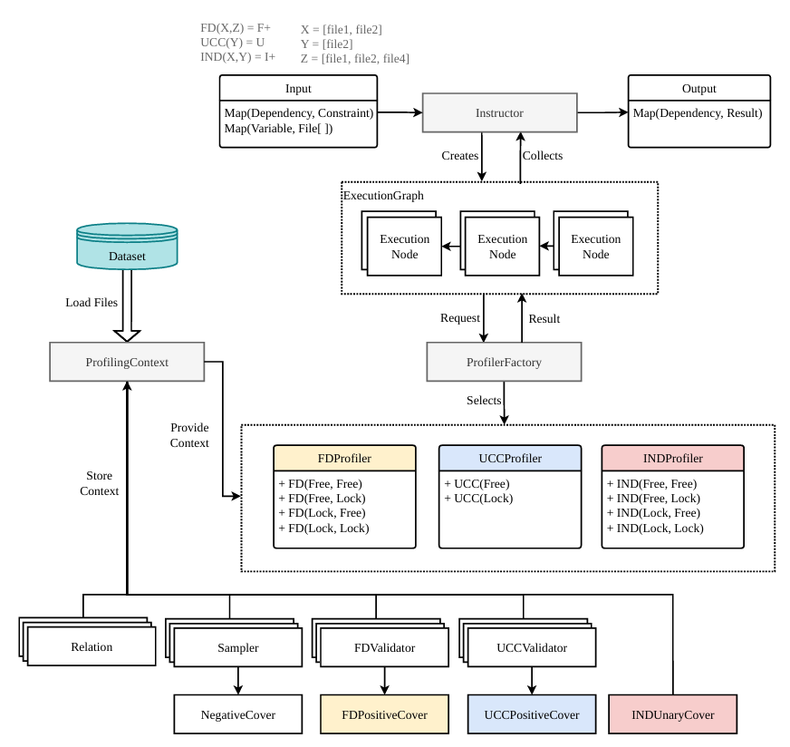
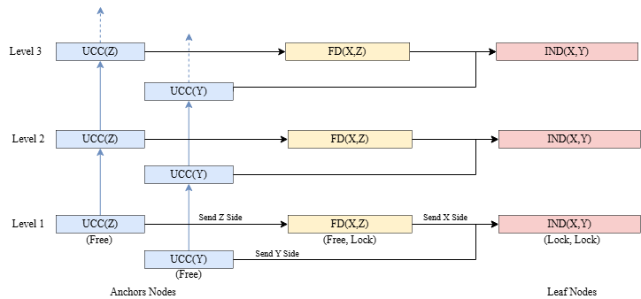
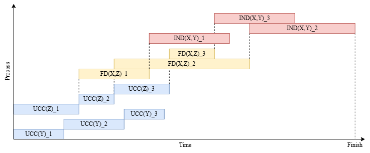

# DPQL Execution Engine

A holistic constraint-driven dependency discovery engine for the **Data Profiling Query Language (DPQL)**.

This project implements the missing *Constraint-Driven Dependency Discovery* component of the DPQL engine, as proposed in [Seeger et al. (2023)](https://hpi.de/oldsite/fileadmin/user_upload/fachgebiete/naumann/publications/PDFs/2023_seeger_dpql.pdf). Instead of running profiling algorithms independently and matching results afterward, this engine coordinates the discovery of Unique Column Combinations (UCCs), Functional Dependencies (FDs), and Inclusion Dependencies (INDs) simultaneously, guided by minimality constraints derived from the query pattern.

---

## Overview



The engine takes a DPQL query pattern and a set of relation files as input. It derives a minimality constraint for each primitive dependency in the query, constructs a level-wise execution graph, and profiles each dependency using a restricted search space derived from upstream results.

**Supported dependency types:**
- Functional Dependencies (FDs) — using a HyFD-inspired profiler
- Unique Column Combinations (UCCs) — using a HyUCC-inspired profiler
- Inclusion Dependencies (INDs) — using a DeMarchi-inspired profiler

**Supported profiling modes per dependency:**

| Dependency | Modes |
|---|---|
| FD | Free/Free, Free/Lock, Lock/Free, Lock/Lock |
| UCC | Free, Lock |
| IND | Free/Free, Free/Lock, Lock/Free, Lock/Lock |

---

## System Components

### Instructor
The central orchestrator. Receives the constraint map and relation map from the query parser, constructs the execution graph, schedules all execution nodes, and collects results.

### Profiling Context
A shared resource provider for all profiling components. Maintains lazily initialized resources including `Relation` objects, `Sampler`, `FDValidator`, `UCCValidator`, and `INDUnaryCover`. All resources are protected with double-checked locking for thread safety.

### Execution Graph
A directed graph of `ExecutionNode` objects built level-wise. Each node encapsulates a single dependency at a specific LHS size level. Nodes wait for parent nodes to complete before starting, and pass results downstream as locked search spaces.



### Profilers
Three profilers handle the actual dependency discovery:
- `FDProfiler` — extends HyFD with a validated bitset and concurrent read/write locking on the FD positive cover tree
- `UCCProfiler` — extends HyUCC similarly for UCC discovery
- `INDProfiler` — uses DeMarchi-style inverted index intersection for unary IND discovery and in-memory tuple validation for n-ary INDs

### Execution Timeline



---

## Key Design Decisions

- **Shared Sampler**: A single `Sampler` instance is shared between the FD and UCC profilers, avoiding redundant record pair comparisons and sharing the negative cover (agree-sets).
- **Extended Positive Cover**: The FD and UCC positive cover trees are extended with a `validated` bitset per node, enabling efficient candidate inference for locked search spaces without redundant re-validation.
- **Lazy Loading**: Relation data is loaded on demand. Only the schema (column count) is read at initialization; actual records are loaded when first requested by a profiler.
- **Level-wise Pipeline**: Results at level `ℓ` are passed downstream while the anchor profiler continues to level `ℓ+1`, enabling pipeline parallelism across dependency stages.

---

## Requirements

- Java JDK 1.8 or later
- Maven 3.1.0 or later
- Git

**Dependencies:**
- [org.reflections](https://github.com/ronmamo/reflections)
- [antlr](https://github.com/antlr/antlr4) — for DPQL query parsing
- [akka](https://github.com/akka/akka)
- [junit](https://github.com/junit-team/junit4) — for evaluation test suites
- [logback](https://github.com/qos-ch/logback) — for logging

---

## Usage

1. Place your CSV dataset files in the `data/` folder.
2. Write a DPQL query following the [DPQL guidelines](https://github.com/SeegerM/DPQL/wiki).
3. Run the engine and read results in the console.

Example query:
```sql
SELECT X AS ForeignKey, Y AS Key
FROM CC(*) X, CC(*) Y
WHERE IND(X,Y) AND UCC(Y)
```

---

## Evaluation

The engine was evaluated against 38 DPQL query patterns across 5 datasets:

| Dataset | Size | Relations |
|---|---|---|
| WDC (Astrology) | 0.02 MB | 11 |
| TPC-H Small | 11.2 MB | 8 |
| TPC-H Large | 425 MB | 7 |
| Sakila | 2.9 MB | 15 |
| AdventureWorks | 90.4 MB | 67 |

Datasets can be downloaded from this like: https://drive.google.com/file/d/1hxErQkLSeWK_H9mVPJnO3xwI1_KXCyeM/view?usp=sharing

The holistic engine consistently outperforms the baseline (independent execution + post-processing matching) in both result completeness and execution time.

The result python validation scripts can be found inside 'scripts/validation'


| Ref | Query | Constraints | Application Area | Application |
|-----|-------|-------------|-----------------|-------------|
| `b1` | `FD(X,Y) AND UCC(Y)` | Fv⁺ : U |  |  |
| `b2` | `FD(X,Y) AND UCC(X)` | F⁺ : U |  |  |
| `b3` | `IND(X,Y) AND UCC(Y)` | I⁺ : U | Data Linkage / Query Optimization | Foreign Key / Foreign Key Rule |
| `b4` | `IND(X,Y) AND UCC(X)` | I⁺ : U |  |  |
| `b5` | `IND(X,Y) AND FD(Y,Z)` | I⁺ : F |  |  |
| `b6` | `IND(X,Y) AND FD(X,Z)` | I⁺ : F |  |  |
| `b7` | `IND(X,Y) AND FD(Z,Y)` | I⁻ : F |  |  |
| `b8` | `IND(X,Y) AND FD(Z,X)` | I⁻ : F |  |  |
| `b9` | `IND(X,Y) AND IND(X,Z)` | I⁻ : I⁻ |  |  |
| `b10` | `IND(X,Y) AND IND(Y,Z)` | I⁻ : I⁻ |  |  |
| `t1` | `UCC(X) AND IND(X,Y) AND UCC(Y)` | U : I⁺ : U | Schema Normalization | Redundant Normalization |
| `t2` | `FD(X,W) AND IND(X,Y) AND FD(Y,Z)` | F⁺ : I⁺ : F⁺ | Data Linkage / Data Analytics | Embedded-Embedded Link / Cross-Table Common Cause |
| `t3` | `FD(W,X) AND IND(X,Y) AND FD(Z,Y)` | F : I⁻ : F | Data Analytics | Cross-Table Common Effect |
| `t4` | `FD(X,W) AND IND(X,Y) AND FD(Z,Y)` | F : I⁺ : Fv⁺ | Machine Learning | Cross-Table Redundant ML Feature |
| `t5` | `FD(W,X) AND IND(X,Y) AND FD(Y,Z)` | Fv⁺ : I⁺ : F |  |  |
| `t6` | `IND(X,Z) AND IND(X,Y) AND UCC(Y)` | I⁺ : I⁺ : U |  |  |
| `t7` | `IND(Z,X) AND IND(X,Y) AND UCC(Y)` | I⁺ : I⁺ : U |  |  |
| `t8` | `IND(Y,Z) AND IND(X,Y) AND UCC(Y)` | I⁺ : I⁺ : U | Query Optimization | Transitive Join Rule |
| `t9` | `IND(Z,Y) AND IND(X,Y) AND UCC(Y)` | I⁺ : I⁺ : U |  |  |
| `t10` | `IND(X,Z) AND IND(X,Y) AND UCC(X)` | I⁺ : I⁺ : U |  |  |
| `t11` | `IND(Z,X) AND IND(X,Y) AND UCC(X)` | I⁺ : I⁺ : U |  |  |
| `t12` | `IND(Y,Z) AND IND(X,Y) AND UCC(X)` | I⁺ : I⁺ : U |  |  |
| `t13` | `IND(Z,Y) AND IND(X,Y) AND UCC(X)` | I⁺ : I⁺ : U |  |  |
| `t14` | `FD(X,Z) AND IND(X,Y) AND UCC(Y)` | F⁺ : I⁺ : U | Data Linkage | Embedded Link |
| `t15` | `FD(Z,X) AND IND(X,Y) AND UCC(Y)` | Fv⁺ : I⁺ : U |  |  |
| `t16` | `FD(Y,Z) AND IND(X,Y) AND UCC(Y)` | F⁺ : I⁺ : U |  |  |
| `t17` | `FD(Z,Y) AND IND(X,Y) AND UCC(Y)` | Fv⁺ : I⁺ : U |  |  |
| `t18` | `FD(X,Z) AND IND(X,Y) AND UCC(X)` | F⁺ : I⁺ : U |  |  |
| `t19` | `FD(Z,X) AND IND(X,Y) AND UCC(X)` | Fv⁺ : I⁺ : U |  |  |
| `t20` | `FD(Y,Z) AND IND(X,Y) AND UCC(X)` | F⁺ : I⁺ : U⁺ |  |  |
| `t21` | `FD(Z,Y) AND IND(X,Y) AND UCC(X)` | Fv⁺ : I⁺ : U |  |  |
| `t22` | `FD(X,Z) AND IND(X,Y) AND UCC(Z)` | Fv⁺ : I⁺ : U |  |  |
| `t23` | `FD(Z,X) AND IND(X,Y) AND UCC(Z)` | F⁺ : I⁻ : U |  |  |
| `t24` | `FD(Y,Z) AND IND(X,Y) AND UCC(Z)` | Fv⁺ : I⁺ : U |  |  |
| `t25` | `FD(Z,Y) AND IND(X,Y) AND UCC(Z)` | F⁺ : I⁻ : U |  |  |

---

## Limitations

- Requires at least one individually minimal primitive dependency in the query pattern as an anchor node. Queries without such a dependency (e.g. all constraints in `F+`, `U+`, or `I+`) produce incomplete results.
- No persistent state between sessions. All in-memory structures are rebuilt from scratch on each engine start.
- Tested on datasets up to approximately 500 MB. Larger datasets may cause out-of-memory errors due to the absence of systematic memory management.

---

## Related Work

This engine builds on the following algorithms and frameworks:
- [HyFD](https://hpi.de/oldsite/fileadmin/user_upload/fachgebiete/naumann/publications/PDFs/2016_papenbrock_a.pdf) - Hybrid Functional Dependency Discovery
- [HyUCC](https://hpi.de/fileadmin/user_upload/fachgebiete/naumann/publications/2017/paper.pdf) - Hybrid Unique Column Combination Discovery
- [DeMarchi et al.](https://www.researchgate.net/publication/225160065_Efficient_Algorithms_for_Mining_Inclusion_Dependencies) - Efficient Algorithms for Mining Inclusion Dependencies
- [DPQL](https://hpi.de/oldsite/fileadmin/user_upload/fachgebiete/naumann/publications/PDFs/2023_seeger_dpql.pdf) - Data Profiling Query Language
- [DPQL Applications](https://dl.gi.de/server/api/core/bitstreams/f7da8905-3d8c-4f67-ac81-816059499340/content) - Applications of Data Profiling Query Language
- [Minimality](https://dl.acm.org/doi/pdf/10.1145/3799992) - Profiling Minimal Data Dependency Combinations

---

## Supervisors

Developed under the supervision of **Prof. Dr. Thorsten Papenbrock** and **Marcian Seeger** at the Big Data Analytics Research Group, Philipps-Universität Marburg.